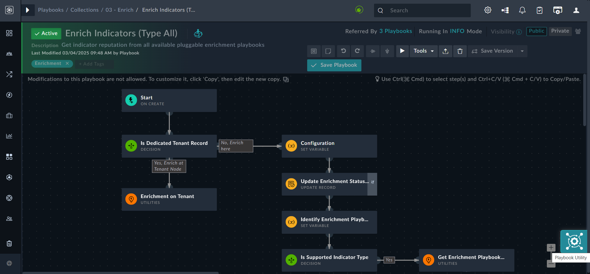
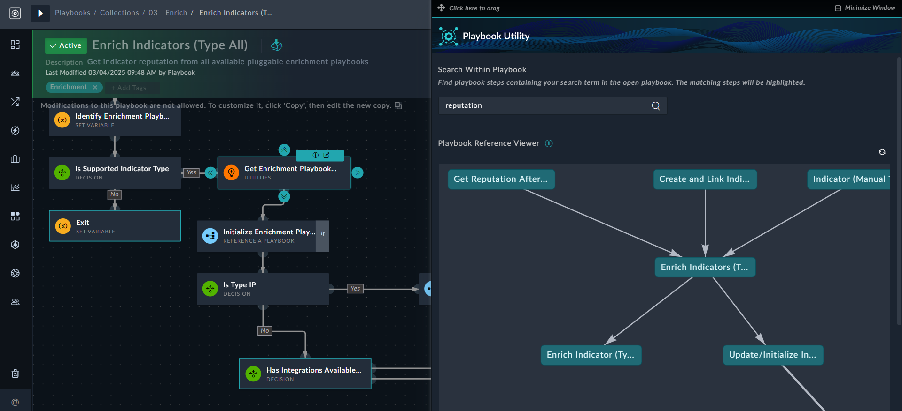
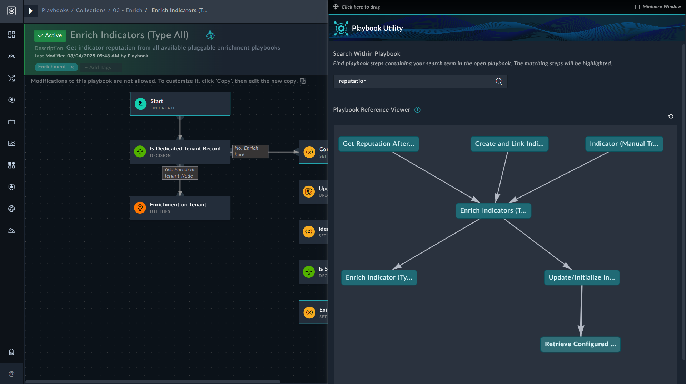

| [Home](../README.md) |
|----------------------|

# Usage

The Playbook Utility Widget adds the **Playbook Utility** icon to the lower-right corner of the playbook designer,  providing a comprehensive view of the current playbook's relationships. It displays both referencing and referenced playbooks of the current playbook, helping users navigate interconnected and nested playbooks through a visual tree structure.

To view the playbook relationships, open a playbook in the designer, and click the **Playbook Utility** icon in the lower-right corner of the screen:

 

Clicking the **Playbook Utility** icon opens the '***Playbook Utility***' modal, which contains the **Search** feature and the **Playbook Reference Viewer**.

## Using the Search Feature

The **Search Within Playbook** box helps users find playbook steps including variables, step names, and more, that contain the search term within the open playbook. When a match is found in any step within the open playbook, those steps are highlighted in the playbook designer. For example, searching for `reputation` in the sample playbook, `Enrich Indicators (Type All)` highlights steps such "Exit" (Set Variable step), "Has Integration Available" (Decision step), among others: 

 

## Using the Playbook Reference Viewer

The **Playbook Reference Viewer** displays the relationships between the current playbook and its referenced and referring playbooks in a tree structure. This feature simplifies building complex playbooks without needing to navigate away from the current playbook, find the referenced or referring playbook, and return to the current one. It also assists in debugging and understanding the overall workflow. Additionally, you can click on any related playbook name to open it in a new window for further inspection.

 

## Next Steps

| [Installation](./setup.md#installation) | [Configuration](./setup.md#configuration) |
| --------------------------------------- | ---------------------------------------- |
